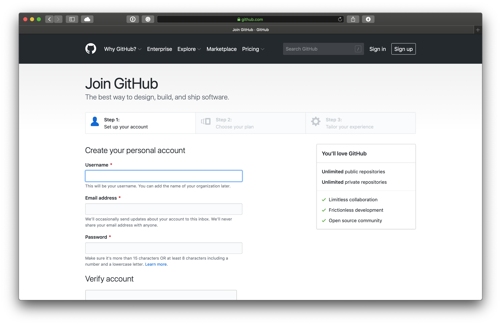
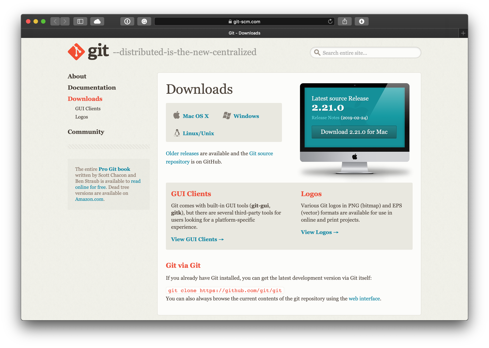

# Learning Git / GitHub 🐙🐱

##### [EDS GitHub Organization](https://github.com/everydaydesignstudio)

## Overview
> Git is a free and open source distributed version control system designed to handle everything from small to very large projects with speed and efficiency. 
> _- [https://git-scm.com](https://git-scm.com)_

> GitHub is a web-based hosting service for version control using Git. It is mostly used for computer code. It offers all of the distributed version control and source code management (SCM) functionality of Git as well as adding its own features. 
> _- [GitHub Wikipedia](https://en.wikipedia.org/wiki/GitHub)_

## Signup & Installation

### GitHub
Go to [GitHub.com](https://github.com) and hit `Sign Up`.  
You can't change your username later, so choose carefully. 🙂

After signing up, email [jordan_white@sfu.ca](mailto:jordan_white@sfu.ca) your username and he will add you to the _Everyday Design Studio_ organization.

You can edit the [Guides](README.md) from the web interface. However, the full power of GitHub is using it to keep track of changes to files on your local system and collaborately working on the same project with other people.

### Installing Git
First you need to download a program called Git onto your computer. Git is the underlying technology that GitHub is built on top. It was developed by the legendary [Linus Torvalds](https://en.wikipedia.org/wiki/Linus_Torvalds), the same fellow who wrote the Linux kernel.

Below are steps for both Mac and Windows on how to install Git along with accompanying GUI software to makde it easier to use.

### Mac
[Tutorial: Install Git on Mac](https://hackernoon.com/install-git-on-mac-a884f0c9d32c)  
[Direct Download of Git](http://git-scm.com/download/mac)

**Terminal**  
After installing Git, you can begin using it via the Terminal. 

**[Sourcetree](https://www.sourcetreeapp.com)** 
If you are brand new to Git, it is recommended to first use a GUI. Sourcetree is the best GUI Mac software for Git.

### Windows
[Tutorial: Install Git on Windows](https://hackernoon.com/install-git-on-windows-9acf2a1944f0) 
[Direct Download of Git](https://git-scm.com/download/win)

**[Git for Windows](https://gitforwindows.org)**  
Since Windows doesn't come with a built in terminal, you'll need to first download a command line program before using Git. We recommend Git for Windows.

After clicking [Download](https://github.com/git-for-windows/git/releases/latest) you'll be taken to a GitHub page where you will see download links at the bottom of the page. Select either the 32 or 64 bit version depending on your computer. (More than likely you'll want the 64 bit version).

**[Sourcetree](https://www.sourcetreeapp.com)**   
If you are brand new to Git, it is recommended to first use a GUI. Sourcetree is the best GUI Windows software for Git.

## Using Git & GitHub
Below are some great tutorials to learn the basics.

* [GitHub Learning Lab](https://lab.github.com)
* [GitHub Guides: Hello World](https://guides.github.com/activities/hello-world/)
* [Learn Git Branching](https://learngitbranching.js.org)

## Register a Public SSH Key

You must create a public SSH key and register the key to your Github account to be able to clone, pull or push without having to enter your username and password each time.

* [GitHub Help: Generating a new SSH key](https://help.github.com/en/articles/generating-a-new-ssh-key-and-adding-it-to-the-ssh-agent)
    * If you don't have a .ssh folder on your machine, create an empty folder: `mkdir ~/.ssh | chmod 700 ~/.ssh`. 
* [Register a new key on Github](https://help.github.com/en/enterprise/2.16/user/articles/adding-a-new-ssh-key-to-your-github-account)
	* Then run: `ssh -T git@github.com` to test your new SSH connection with GitHub.

Thats it! You should be good to clone and checkout.

---
**[Home](README.md)** | **[Git Commands](git-commands.md)** | **[Markdown](markdown.md)**

