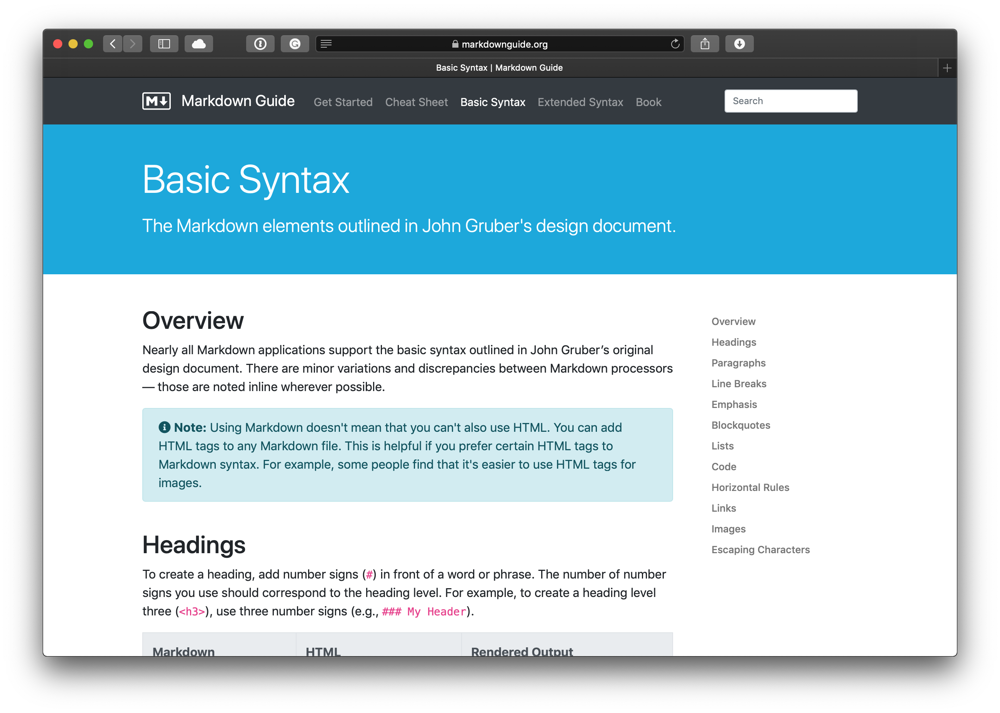
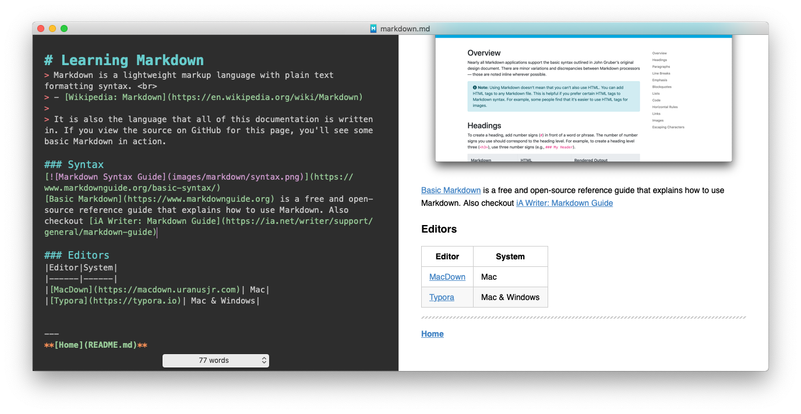

# Learning Markdown
> Markdown is a lightweight markup language with plain text formatting syntax.  
> - [Wikipedia: Markdown](https://en.wikipedia.org/wiki/Markdown)
>
> It is also the language that all of this documentation is written in. If you view the source on GitHub for this page, you'll see some basic Markdown in action.

### Syntax

[Basic Markdown](https://www.markdownguide.org) is a free and open-source reference guide that explains how to use Markdown. Also checkout [iA Writer: Markdown Guide](https://ia.net/writer/support/general/markdown-guide)

### Editors

_MacDown_

|Editor|System|
|------|------|
|[MacDown](https://macdown.uranusjr.com)| Mac|
|[Typora](https://typora.io)| Mac & Windows|

---
**[Home](README.md)** | **[Git / Github](git-github.md)**

