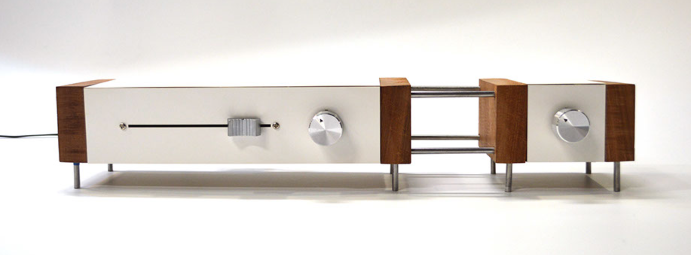
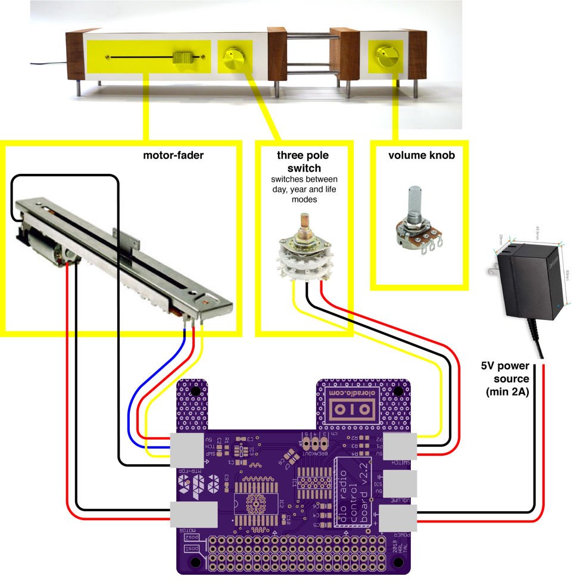
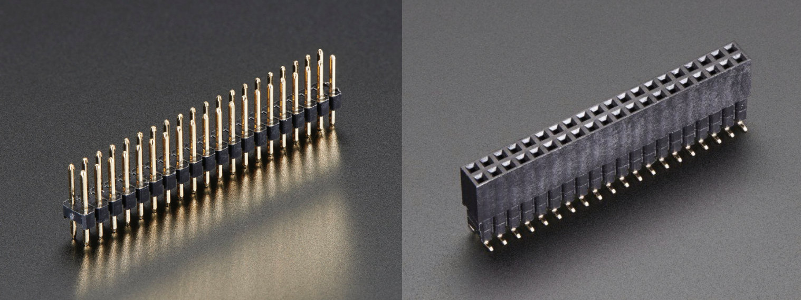

# [olo radio 📻](http://oloradio.com)

---

### Hardware
The purple OLO PCB (control board) connects the several hardware parts to the raspberry pi. These components are illustrated in figure 1. Make sure the board is connected to a 5V power source (min. 15W); the DC-DC converter (labelled ‘power supply’) in combination with the 9V 2A power adapter suffices. In figure 1, you can also see how these components are connected to the control board. Every white connector on the control board is labeled with white lettering on the board itself to denote what is connected to it. For the purpose of not mistaking the two, the power connector and the motor connector are a different type of connector. The volume knob and the three-pole switch though, are identical; so keep that in mind if you ever need to connect these.

_The OLO radio control board and its components_

---

### Interfacing with OLO components
In order to interface with the components (through the olo PCB), make sure that the olo PCB is connected to the RPi properly. The RPi has a 2x20 male header (see figure 2) which fits the olo PCB. You might notice that the OLO PCB (v2.2) hits the Ethernet adapter when connected directly on the RPi. This is going to be fixed in later revisions of the board, but is not an issue that impedes the functionality of the board.

When the OLO PCB is connected to the RPi, make sure the RPi is connected to a 5V power source (such as a 5V power adapter that can be plugged into the mains). When the RPi is powered up, a power LED should light up on the RPi.

_A 2x20 male header (left) and a 2x20 female header (right)_

### Coding
When writing code for OLO, import the `oloFunctions.py` file into your python code. In this file, functions are defined for several functionalities, briefly described in each functions’ comments. You will find that oloFunctions.py is imported in several other scripts in the olo repository. Another recurring file is sh.py; this file contains global variables that are shared between scripts. 

When using `sh.py` in your file, make sure to both import it: `import sh`

As well as initialize it: `sh.init()`

The latter simply calls a function inside sh.py that initializes all global variables.
For more information on the hardware components, I would advise on doing a web search on the parts’ model number. Datasheets of the ALPS motor-fader and most components that are on the OLO board can be found in the olo folder on the EDS dropbox.

---
**[Home](README.md)** | **[Capra](capra.md)**
