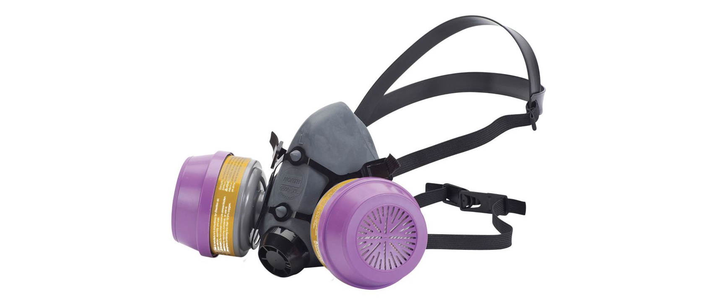

# Safety
> Safety is not a gadget but a state of mind.
> -- Eleanor Everet
> 
> Safety is something that happens between your ears, not something you hold in your hands.
> -- Jeff Cooper

## Equipment

###Respirators

**Recommended:**

* [Stanley R95 Organic Respirator](https://www.canadiantire.ca/en/pdp/stanley-r95-organic-vapour-respirator-0550135p.html#srp) `$54.99` @ Canadian Tire 

* [Stanley MC P100 Respirator](https://www.canadiantire.ca/en/pdp/stanley-mc-p100-respirator-0550137p.html#srp) `$59.99` @ Canadian Tire   _Note: this respirator will also work for organic fumes, plus non-organic chemicals._

For more information on which catridges proctect against which fumes and chemicals, checkout this listing: [Honeywell gas/vapor catridges - NIOSH standard](https://www.honeywellsafety.com/Products/Respiratory_Protection/N_series_cartridge_for_gases/vapors_protection_(NIOSH_standard)(1).aspx?site=/asia). 
For further information on how they work check out this article: [Air-Purifying Respirators Explained](https://www.coopersafety.com/respirator-types)

---
**[Home](README.md)**