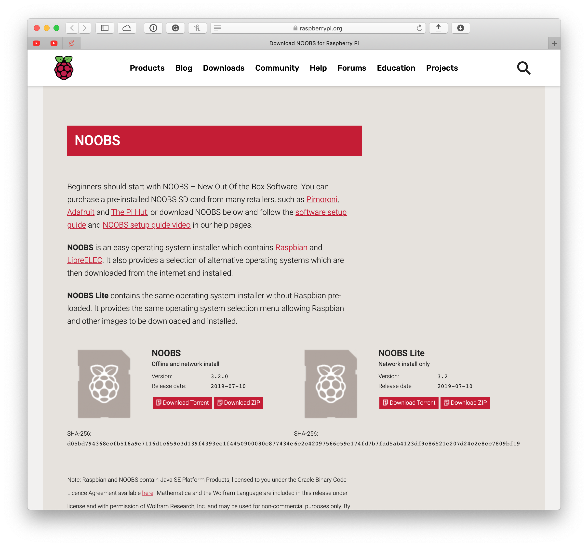
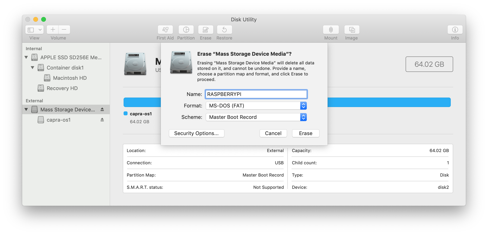
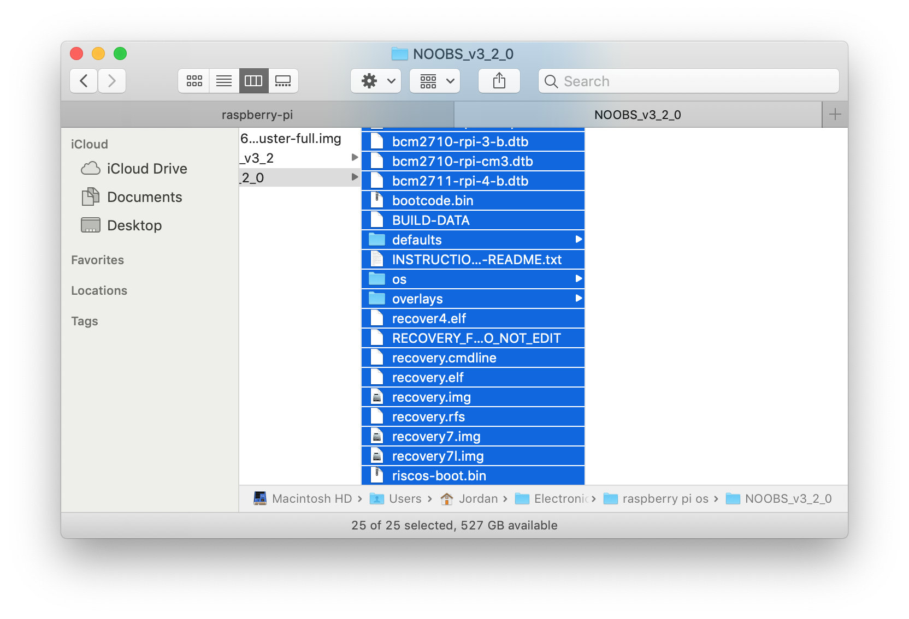
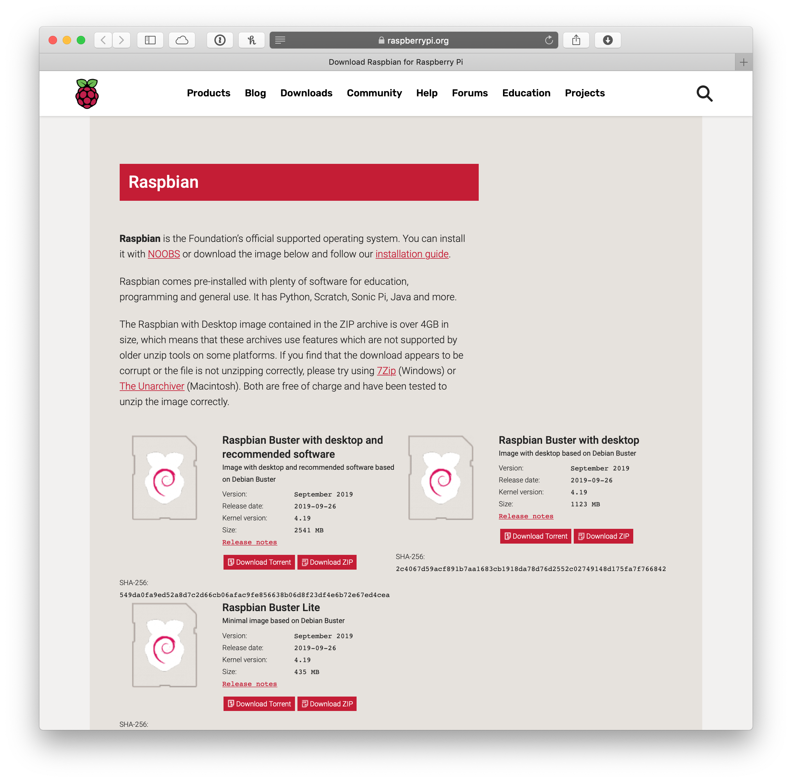

# Setup a Brand New Raspberry Pi 🥧

### Overview of steps we'll take
---
TODO: add table of contents

## Installing an Operating System on Memory Card
The hard drive for a Raspberry Pi is the memory card. This means that the OS is installed on it. The recommended type of memory card is listed on the [RPi Introduction guide](raspberry-pi-introduction.md#sd-card)


**Raspbian** is the Raspberry Pi Foundation’s official supported operating system. You can install it with NOOBS or by Flashing a downloaded image to your memory card.


### NOOBS
---
#### Download
**NOOBS is an easy operating system installer** which contains Raspbian and LibreELEC. It also provides a selection of alternative operating systems which are then downloaded from the internet and installed when the Pi is turned on for the first time.

Go to [https://www.raspberrypi.org/downloads/noobs/](https://www.raspberrypi.org/downloads/noobs/) for the latest version of NOOBs. Download either NOOBS or NOOBS Lite.



#### Format Memory Card
To use NOOBS you should use **Disk Utility** (or similar program for Windows) to format your SD card with the following settings:


#### Installing NOOBS
Copy the contents of the NOOBS folder to the memory card.


### Flashing
---
Flashing directly installs an operating system from an OS image to your memory card.

#### Download
Download Raspian from: [https://www.raspberrypi.org/downloads/raspbian/](https://www.raspberrypi.org/downloads/raspbian/)


Most studio projects have used *Rapsian with Desktop* because of the added benefits of visually controlling the device. For products which require low power usage, Raspian Lite should be considered.

#### Flashing
The recommended program to use is **[balenaEtcher](https://www.balena.io/etcher/)**. It is available for both Mac and Windows.


## First Time Starting Up
* Choose your Localization Settings
* Connect to a WiFi network
* Raspberry Pi Configuration
* Setup VNC


* pull `.bash_profile` for keyboard shortcuts
* `ssh stuff` between devices
* `mkdir Developer` and clone GitHub projects

* run `make`

* Bash script


|package|command|
|-------|-------|
| Vim | sudo apt-get install vim|
| Tkinter | sudo apt-get install python3-pil python3-pil.imagetk |
| ExFat | sudo apt-get install exfat-fuse exfat-utils |


* `python -V` `python3 -V`


`ssh pi@192.168.0.114` #password: capra

`cd /media/pi/capra-hd/hike1/`

---
---
---
# Old Content

---
---
---


---
---
---


### Finding RPi IP Address
On the RPi find the IP address by opening up a terminal and typing: `ifconfig`. Under **wlan0** you will find the IP address. <br>It will look something like this <br>
```
...
wlan0: flags=8863<UP,BROADCAST,SMART,RUNNING,SIMPLEX,MULTICAST> mtu 1500
        inet 192.168.0.104 netmask 0xffffff00 broadcast 192.168.0.255
...
```
If the IP were to change, you can find it again using this method.

---

### Controlling over SSH
You can run the RPi in what is called a ‘headless’ mode. This means no screen, no keyboard and mouse or other conventional control peripherals. In order to control the RPi in this manner, you can connect to it over SSH. Most RPis the studio have an onboard WiFi antenna and are capable of connecting to the studio’s wireless network (eds2g or Morse Things network).

1. In order to connect to the RPi over SSH you first need to make sure _your laptop_ and the _RPI_ are connected to the same wireless network. Because eduroam and SFUNET-SECURE require extra steps, the easiest choice is eds2g or eds5g when working in the studio.

2. Back on your laptop open up a Linux terminal and type the following command and hit enter: <br>
`ssh pi@192.168.0.101` (where _192.168.0.101_ is the IP address of your specific RPi). If you don't know your RPi's IP, [see above](#finding-rpi-ip-address).

3. If the RPi is on and has an active internet connection, you should see the following response:
`pi@192.168.0.101's password:`

4. You can then type the password to user ‘pi’ on the RPi and confirm with Enter.

Once your in, you can navigate the RPi just like you would any Linux machine, using `ls`, `cd`, `touch`, `mkdir`, etc.

In case you are setting up a new RPi and running it in headless mode, [this website](https://howtoraspberrypi.com/how-to-raspberry-pi-headless-setup/) does a good job of explaining how you make a RPi connect to a WiFi network without ever requiring so much as a mouse or keyboard for the RPi itself. Handy if you’re working on a laptop and have no external keyboard/mouse or display available.

### Connecting over VNC
The RPi also has VNC software installed. In case you require the desktop environment of the RPi, but can't connect a display to it, you can use your own VNC software to connect to the RPi.

1. On your laptop, download [`VNC Viewer`](https://www.realvnc.com/en/connect/download/viewer/). Note that unless you will need to be streaming your desktop, you just need VNC Viewer, not VNC Server. Also note that the titles on the VNC website make it confusing as to which program you're downloading.

2. On the RPI open VNC server to _broadcast_ your RPi's desktop over the network.

3. On your laptop, VNC Viewer, enter the IP address of the RPi. This is like selecting a particular chanel on a TV. If you don't know your RPi's IP, [see above](#finding-rpi-ip-address)

4. It should connect and you will be able to see the desktop of the RPi on your laptop.

#### Connecting to Pi over Cloud (on VNC)
Follow [this](https://lifehacker.com/how-to-control-a-raspberry-pi-remotely-from-anywhere-in-1792892937) instruction to create a VNC cloud account and list devices under the account to get cloud access to Pi from anywhere.

### Creating unique names for RPi's
When working remotely frequently with multiple RPi's, it might be advisable to give the RPi's unique names. This means seeing:
_pi@capra-collector1_
 in the terminal instead of the default:
_pi@raspberrypi_

This is done simply by opening the terminal in Raspbian (or connecting over SSH) and typing _sudo raspi-config_, followed by pressing enter. You now get a menu that looks like this:


Use the arrow keys to choose Network Options, and then change the hostname. The RPi will have to reboot after changing the hostname but will then show up with the name in the terminal.

---

### Programs to Install
_Here's a few recommended programs consider installing_

| Program| Link / Code|
|--------|------------|
|Processing | https://pi.processing.org|
|[SQLite Browser](https://sqlitebrowser.org) | `sudo apt-get install sqlitebrowser`|
|Vim | `sudo apt-get install vim`|
|[xclip](https://coderwall.com/p/oaaqwq/pbcopy-on-ubuntu-linux)|`sudo apt-get install -y xclip`|
|xscreensaver | `sudo apt-get install xscreensaver`|

---

### Update Python version
All new projects should start with at least Python 3.7.x. If you aren't sure the version on your machine, you can run `python3 --version` to check.<br>
[Instructions to update Python version](https://installvirtual.com/install-python-3-7-on-raspberry-pi/)
`

---

### Programming the RPi
>In the past I’ve edited code on the RPi (i.e. not headless, but while connecting the RPi to a display, keyboard and mouse). This is also possible, but the code editor on the RPi does not come close to the code editor you’re using on your laptop in terms of ease of use. Besides, the RPi is a somewhat slow computer, so typing can lag behind. - Tal Amram

### IO Programming
```python
import RPi.GPIO as gpio

gpio.setmode(gpio.BCM)
gpio.setup(24, gpio.OUT)
gpio.output(24, True)
```
Save As: `foo.py` <br>
Run: `python3 ./foo.py`

---

### Helpful Commands
|What|Command|
|----|-------|
|Python version|`python --version`|
|Shutdown|`sudo shutdown -h now`|
|Reboot|`sudo reboot`|
|View python scripts running|`pgrep -af python`|
|[Kill process](https://www.linux.com/learn/intro-to-linux/2017/5/how-kill-process-command-line)|`sudo kill -9 [pid]`|
|[Set WiFi Network Passwords](https://www.raspberrypi.org/documentation/configuration/wireless/wireless-cli.md)|`sudo vim /etc/wpa_supplicant/wpa_supplicant.conf`|


---
**[Home](README.md)** | **[Setup eduroam on RPi 3](setup-eduroam-raspberry-pi-3.md)** | **[Raspberry Pi Advanced](raspberry-advanced.md)**
